# RFC: pretalx-First Speaker Operations with Rails Clean-Room Fallback

| Field | Value |
|---|---|
| Status | Final / Accepted — eligibility gate remains |
| Owner | Jai Bhagat |
| Last updated | 2026-08-08 |
| Decision deadline | First competition hour |
| Related document | `kill-my-saas-prd.md` |

## 1. Summary

Build Open Speaker Operations as a disclosed, license-compliant extension of pretalx. This maximizes acceptance-criteria coverage before the deadline and concentrates original work on the AIE-specific gaps: onboarding tasks, outstanding-work dashboard, conditional routing, AI review assistance, calendar delivery, Accelevents synchronization, resources, and polished embeds.

This decision is conditional on one first-hour rules check: disclosed derivatives must be allowed. If the organizers prohibit forks or derivative work, activate the clean-room Rails 8 fallback described in this RFC and limit it to the golden path.

Regardless of application foundation, package the system as a portable OCI container, deploy judge-critical compute to a DigitalOcean Droplet, keep PostgreSQL and object storage external, and put Cloudflare at the edge.

The recommended competition topology is:

- pretalx/Django web and Celery worker roles deployed as containers to one DigitalOcean Droplet; Rails web/worker roles use the same topology if fallback activates.
- DigitalOcean Managed PostgreSQL in the same region and VPC when budget permits.
- DigitalOcean Container Registry or GitHub Container Registry for immutable release images.
- Cloudflare DNS, proxy/CDN, TLS, WAF/rate limiting, Turnstile, and R2.
- GitHub Actions as the CI/CD control plane.
- An optional, independently promoted Cloudflare Containers environment to earn infrastructure bonus credit and validate portability.

This satisfies the spirit of “Cloudflare infrastructure” without making the demonstration depend on a comparatively new container runtime. The Droplet is intentionally treated as replaceable compute: no authoritative uploads or database state live only on its local disk.

## 2. Background

The product is a strongly relational workflow application: proposals become reviewed decisions, accepted sessions create onboarding work, sessions are assigned to constrained schedule slots, and publication triggers external synchronization. This fits a conventional modular monolith better than an edge-function decomposition. pretalx already implements the highest-risk conference primitives; Rails remains the clean-room fallback.

Cloudflare Workers do not provide a native CRuby/Rack runtime. Ruby-to-WebAssembly experiments exist, but a Rails application depends on a full Ruby runtime, native libraries, process behavior, database drivers, background execution, and filesystem assumptions that make Workers a poor target.

Cloudflare Containers can execute arbitrary `linux/amd64` images behind a Worker. Cloudflare’s current deployment flow uses Wrangler to build and push an image and deploy the routing Worker. However, the platform documentation notes that initial provisioning can take minutes and that requests can fail while a container is becoming ready. That is meaningful competition-demo risk. [Cloudflare Containers getting started](https://developers.cloudflare.com/containers/get-started/)

The brief awards only mild bonus points for Cloudflare. Runtime portability and a reliable deployed site are more important than exclusive Cloudflare execution.

## 3. Problem

We need to reconcile five constraints:

1. The independent evaluation rewards actual feature coverage and operational quality.
2. “An open source clone that YOU make (and keep)” may or may not permit a disclosed derivative.
3. The final application must be deployed and testable by a deadline.
4. Cloudflare infrastructure earns bonus consideration.
5. CI/CD must remain deterministic, reversible, and portable if a target platform fails.

A clean-room Rails build reduces licensing/rules ambiguity but cannot reproduce pretalx’s mature CFP, review, scheduling, permissions, public API, and edge-case coverage within four days. A pretalx derivative provides the strongest product but must pass the rules gate and comply with its current AGPL-3.0 plus additional terms. A deployment architecture that binds either application to Cloudflare Workers would add unrelated runtime risk.

## 4. Decision drivers

Ordered by priority:

1. Reliable judge access during evaluation.
2. Fast implementation of the complete product golden path.
3. Reproducible local and CI environments.
4. Safe database migration and rollback.
5. Visible, substantive Cloudflare usage.
6. Low operational complexity for a small team.
7. Future ability to change hosts without application redesign.

## 5. Proposal

### 5.0 Final architecture decision

The production architecture is a **pretalx-derived modular monolith** on a DigitalOcean Droplet, with PostgreSQL as the transactional authority, Celery for asynchronous effects, R2 for object storage, and Cloudflare at the edge. GitHub Actions builds one immutable OCI image and promotes the same digest through staging and production. This is the implementation track unless the first-hour eligibility check explicitly prohibits derivative work.

Rails 8 is a prepared clean-room fallback, not a second product track. Activating it freezes optional scope and preserves the same deployment, data, job, storage, observability, and integration contracts. Violet Rails is rejected because its CMS/CRM primitives do not supply CFP review phases, speaker availability, schedule releases, or conflict semantics.

### 5.1 Application architecture

Use a single pretalx-derived codebase with independently runnable web and worker processes. If the rules gate fails, substitute the Rails application and Solid Queue worker without changing the infrastructure contract:

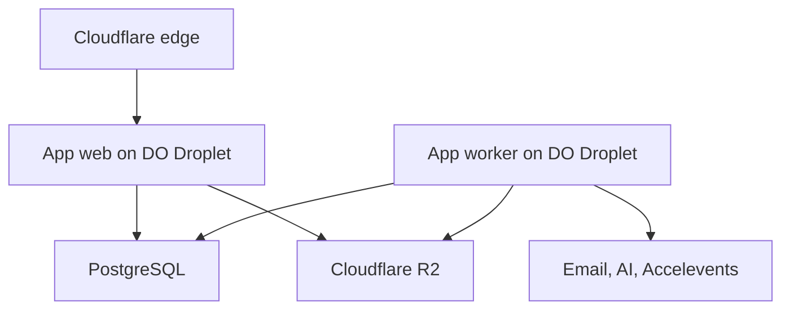

This is one application and one repository, not microservices. Process separation exists only because HTTP serving and asynchronous work have different scaling and failure characteristics.

### 5.2 DigitalOcean Droplet baseline

Use one Ubuntu LTS Droplet in the region nearest the judging team and managed database. Start with **2 shared vCPUs and 4 GB RAM** for the competition environment; increase vertically if load testing shows memory pressure. The application web process, background worker, and `kamal-proxy` may share this host at demonstration scale.

Provisioning requirements:

- SSH-key authentication only; disable password login and direct root password access.
- DigitalOcean Cloud Firewall permits inbound `22` only from controlled operator/CI sources where practical, plus `80/443` for application traffic.
- Automatic security updates and basic host monitoring.
- Swap may protect against abrupt memory exhaustion but is not a substitute for adequate RAM.
- No PostgreSQL or user-uploaded files on ephemeral Droplet storage in the preferred topology.
- DigitalOcean monitoring plus application-level error tracking and synthetic checks.
- A snapshot before major host-level changes; application releases rely on container-image rollback rather than snapshots.

Kamal is the deployment layer because it targets ordinary VMs over SSH, installs/uses Docker, pulls registry images, runs application roles, and provides gapless proxy transitions and rapid rollback. [Kamal](https://kamal-deploy.org/)

### 5.3 Runtime components

Primary pretalx path:

- Pinned current pretalx commit with upstream remote preserved.
- Supported Python and Django versions from pretalx’s lock/configuration.
- PostgreSQL through Django ORM and event-scoped managers.
- Celery worker using pretalx’s established task configuration.
- Existing pretalx authentication, permissions, mail queue, file storage, API, schedule, and plugin infrastructure.
- Cloudflare R2 through the application’s S3-compatible storage backend.
- Minimal JavaScript additions; preserve the established schedule editor.

Rails fallback:

- Current stable Rails 8.x and supported Ruby.
- PostgreSQL/Active Record, Hotwire, Active Storage on R2, Active Job/Solid Queue, Action Mailer, explicit policies, and a dedicated schedule controller.

### 5.4 Modular monolith boundaries

Organize domain logic by capability, even though it shares one database and deployment:

| Module | Owns |
|---|---|
| Identity | Accounts, organizations, memberships, event roles |
| Program | Events, tracks, rooms, categories, sessions |
| CFP | Forms, fields, answers, proposals, speakers |
| Review | Rubrics, assignments, rounds, scores, decisions, AI suggestions |
| Onboarding | Task templates, tasks, submissions, files, resources |
| Communications | Templates, audiences, deliveries, reminders, ICS artifacts |
| Scheduling | Placements, availability, conflicts, schedule revisions |
| Publishing | Public views, embeds, publication state |
| Integrations | Accelevents mappings, sync runs, external identifiers, Airtable mirror |

Enforce boundaries through service objects and module namespaces, not network calls. Cross-module changes use explicit application services and database transactions.

### 5.5 Data architecture

- PostgreSQL is authoritative for all transactional state.
- R2 stores headshots, slides, and supporting files.
- Airtable, if implemented, is an asynchronous projection for operational visibility—not a source of truth.
- External-provider identifiers are stored locally with unique constraints.
- Integration attempts retain request fingerprints, status, provider response identifiers, retry counts, and errors.
- Schedule conflicts are computed server-side and enforced before publication; browser warnings are convenience, not authority.

### 5.6 Cloudflare usage

Use Cloudflare for components that are mature and independently useful:

1. DNS, TLS termination, proxying, and CDN.
2. WAF and rate limiting for public CFP and embed endpoints.
3. Turnstile on unauthenticated submission and login-risk surfaces.
4. R2 for Active Storage objects.
5. Cache rules for published speaker and schedule pages.
6. Optional Worker for lightweight embed caching, request normalization, or routing.
7. Optional Cloudflare Containers deployment of the same application image.

This is genuine Cloudflare infrastructure participation even if primary application compute runs elsewhere.

## 6. Deployment alternatives considered

### Alternative A: Rails directly on Cloudflare Workers

**Rejected.** Workers do not natively run the standard Ruby/Rack/Rails execution model. Ruby/WASM templates are experimental and closer to Sinatra/Hono-style applications than full Rails. Reimplementing Rails conventions around WASM would trade product delivery for runtime research.

### Alternative B: Cloudflare Containers as the only environment

**Not selected for the competition primary.** It can run the Rails Docker image and is the only credible all-Cloudflare compute route. However, it adds Worker/Durable Object routing, new operational behavior, and provisioning/cold-start risk. It should be validated as an additional target, not the sole judge endpoint.

### Alternative C: Conventional Rails hosting with no Cloudflare

**Viable but leaves value unused.** This minimizes deployment novelty but forgoes Cloudflare bonuses and useful edge controls.

### Alternative C1: DigitalOcean App Platform instead of a Droplet

**Viable fallback, not selected.** App Platform reduces host administration and supports image-based deployments, workers, and deployment jobs. A Droplet plus Kamal provides more control, makes the standard Rails Dockerfile the deployment contract, and avoids introducing a second platform-specific application specification. If the team cannot safely administer a Linux host, App Platform should replace the Droplet rather than accepting an insecure VM.

### Alternative D: Split Workers front end and Rails API

**Rejected for MVP.** It creates two applications, two deployments, API authentication complexity, duplicated rendering decisions, and a larger CI matrix. Public embeds may later move to Workers if traffic warrants it.

### Alternative E: Rewrite in a Workers-native TypeScript framework

**Rejected unless Cloudflare-only compute becomes a hard requirement.** Hono or a similar framework would deploy naturally to Workers, but the project would lose Rails’ integrated relational workflow, mail, jobs, attachments, server rendering, and development speed.

### Alternative F: Fork pretalx

**Selected, subject to the rules gate.** It provides the highest probability of functional acceptance and leaves time for original AIE-specific product work. The derivative must follow the current license, retain attribution, identify modifications, and publish corresponding source.

## 7. Violet Rails assessment

[Violet Rails](https://github.com/restarone/violet_rails) is an open-source Rails-based CMS/app/automation platform. It advertises forms, automation, analytics, multi-tenancy, content, email, and APIs. Those capabilities overlap superficially with the project.

It does **not** solve Cloudflare deployment:

- It remains a conventional Rails application requiring a Ruby runtime.
- Available descriptions identify a Rails 6-era stack with Devise, Sidekiq, PostgreSQL, Bootstrap, and jQuery.
- It is optimized around CMS, websites, automation, and generic entities rather than CFP review, onboarding, schedule constraints, and event integrations.
- Adopting it would introduce an older application architecture and domain abstractions that must be learned or removed.

**Decision:** do not use Violet Rails as the foundation. Generate a clean current Rails application and borrow only clearly useful ideas. A starter can save hours when its domain and maintenance posture align; Violet Rails does not remove the project’s hard work or infrastructure constraint.

## 8. CI/CD design

CI/CD treats the container image—not a hosting provider—as the release artifact.

The selected delivery chain is:

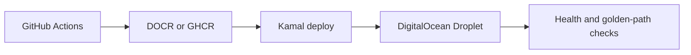

### 8.1 Branch and environment model

| Git ref | Environment | Deployment behavior |
|---|---|---|
| Pull request | Ephemeral test context | Test, scan, build; optional preview deployment |
| `main` | Droplet staging destination | Automatic after all gates pass |
| Version tag or approved workflow | Droplet production destination | Manual approval, migration check, promotion of tested image digest |
| Optional `cloudflare-*` workflow | Cloudflare Containers | Independent, non-blocking deployment of the same image |

### 8.2 Required CI gates

1. Dependency installation from lockfiles.
2. Ruby style/static analysis.
3. Foundation-appropriate dependency and security scans: Python/Django for pretalx; Ruby/Rails if fallback activates.
4. Unit, model, policy, job, request, and system tests.
5. Database migration test from the previous release schema.
6. Asset compilation.
7. OCI image build for `linux/amd64`.
8. Container boot and `/up` health check.
9. Golden-path smoke test against a seeded database.
10. Image vulnerability scan and software bill of materials.

No deployment occurs if a required gate fails.

### 8.3 Build once, promote by digest

- CI builds one immutable image tagged with the commit SHA.
- Staging deploys that exact digest.
- Smoke and integration tests run against staging.
- Production promotes the same digest; it does not rebuild source.
- The Cloudflare Containers workflow consumes the same digest when the platform accepts an external image, or verifies a Wrangler-built image against the source commit when it must build internally.

DigitalOcean Container Registry is the preferred registry when the team already has a DigitalOcean account; it is a private Docker registry designed for CI/CD workflows. GitHub Container Registry is an acceptable lower-friction alternative. [DigitalOcean Container Registry](https://docs.digitalocean.com/products/container-registry/)

This prevents “works on staging, different artifact in production.”

### 8.4 Deployment sequence

1. Run pre-deployment checks and verify required secrets by name, never by value.
2. Take or confirm a recent managed database backup for risky releases.
3. Run backward-compatible migrations using a one-off release process.
4. Run `kamal deploy` against the selected destination, allowing `kamal-proxy` to health-check the new web container before switching traffic.
5. Verify `/up`, database connectivity, asset availability, and one authenticated read.
6. Verify the worker role is running the same image digest and processing a safe probe job.
7. Execute golden-path smoke tests.
8. Mark the release healthy and enable new behavior through feature flags if needed.

### 8.5 Migration policy

Use expand-and-contract migrations:

- Add nullable columns/tables/indexes before code requires them.
- Backfill asynchronously for large data changes.
- Deploy code that reads both old and new forms during transition.
- Remove old fields only in a later release.
- Avoid long table locks and irreversible migrations in deadline-critical releases.

### 8.6 Rollback policy

- Application rollback means `kamal rollback` to the prior known-good image/container.
- Database rollback normally means forward repair, because destructive schema reversal is risky.
- External integration writes are idempotent and cannot be “rolled back” by repeating them; compensating actions must be explicit.
- Cloudflare routing can be switched back to the primary host if the Containers target is unhealthy.

### 8.7 Secrets

- CI uses environment-scoped credentials and least privilege.
- Pull requests from untrusted forks receive no production secrets.
- Production deployment requires an approved protected environment.
- Rails credentials are not the only secret store; runtime secrets live in the hosting platform or approved secret manager.
- Cloudflare API tokens are scoped to the required account resources.
- The CI deploy key is dedicated to deployment, stored in a protected GitHub environment, and authorized only for the deployment user on the Droplet.
- Registry credentials used by the Droplet are read-only; CI alone receives push permission.

### 8.8 Droplet recovery

The Droplet is recoverable rather than precious:

1. Provision a replacement Ubuntu Droplet from documented infrastructure settings.
2. Attach firewall rules and the deployment SSH key.
3. Point the Kamal destination at the replacement IP and deploy the last known-good image.
4. Verify access to Managed PostgreSQL and R2.
5. Run smoke tests.
6. Change the Cloudflare origin to the replacement only after it is healthy.

Because database and uploads are external, recovery does not depend on reconstructing application data from a VM snapshot.

## 9. Cloudflare Containers workflow

The optional target uses a small routing Worker and the same application Dockerfile.

Validation gates specific to this target:

- Build succeeds for `linux/amd64`.
- The application binds to the port provided by the container configuration.
- The container is stateless; uploads go to R2 and sessions/database state go to PostgreSQL.
- Health checks tolerate provisioning behavior but never hide prolonged failure.
- Background workers do not rely on the request-addressed container lifecycle unless Cloudflare’s current platform explicitly supports the required always-on behavior.
- A synthetic monitor periodically exercises the judge-critical endpoint during the evaluation window.

If worker-process semantics are unsuitable, only the application web process runs in Cloudflare Containers; jobs remain on the reliable primary worker host. That is still a valid hybrid deployment of one monolith.

## 10. Testing strategy

### Unit and domain tests

- Proposal and decision state machines.
- Form visibility and validation rules.
- Rubric aggregation.
- Onboarding task completion.
- Schedule conflict detection.
- Integration mapping and idempotency.

### Request and policy tests

- Every role’s allowed and denied access.
- Public/draft publication separation.
- File authorization.
- Rate-limited anonymous endpoints.

### Job and contract tests

- Email rendering and retry.
- ICS stability across update and cancellation.
- AI schema validation and failure fallback.
- Accelevents adapter against recorded fixtures or sandbox responses.

### System tests

- Speaker submission.
- Reviewer scoring.
- Organizer acceptance.
- Speaker onboarding completion.
- Conflict detection and schedule publication.
- Public embed display.
- Synchronization preview, execution, and retry.

### Deployment tests

- Docker boot from a clean environment.
- Migration from last released schema.
- Staging golden path.
- Cache purge/publication correctness through Cloudflare.
- Primary-to-fallback routing procedure.

## 11. Observability

- Structured logs include request ID, job ID, event ID, integration run ID, and release SHA where applicable.
- Error tracking captures web and job exceptions.
- Metrics cover request latency, error rate, queue depth, failed jobs, email delivery, AI cost/latency, synchronization results, and conflict counts.
- `/up` proves process health; a deeper internal readiness check verifies database and required service connectivity.
- Synthetic monitoring checks the public schedule and a safe authenticated workflow.
- Deployment annotations connect regressions to image digests.

## 12. Local development

The repository provides:

- Docker Compose or equivalent for PostgreSQL and supporting services.
- Seeded accounts for organizer, reviewer, and speaker roles.
- A seeded event demonstrating successful and conflicting schedules.
- Fake email delivery and provider adapters by default.
- Optional real-provider credentials through environment variables.
- Commands for setup, test, lint, security scan, web, worker, and full local stack.
- `config/deploy.yml` plus separate Kamal staging and production destination files with no committed secrets.

The first-time setup should not require Cloudflare, Accelevents, or AI credentials.

## 13. Consequences

### Positive

- The selected application remains optimized for product delivery rather than edge-runtime compatibility.
- One codebase and database preserve transactional workflows.
- The container is portable across hosts and Cloudflare Containers.
- Cloudflare contributes meaningful security, storage, caching, and optional compute.
- CI/CD remains stable even if one deployment target is unavailable.

### Negative

- The production topology contains DigitalOcean plus Cloudflare rather than one vendor.
- A Droplet requires OS patching, firewall management, SSH hygiene, disk monitoring, and recovery ownership.
- Cloudflare Containers requires a second deployment path and targeted testing.
- The job system and web traffic share PostgreSQL and host capacity and require monitoring.
- A modular monolith depends on team discipline to preserve internal boundaries.

## 14. Implementation sequence

1. Resolve derivative-work rules gate.
2. Pin and boot pretalx; preserve license, attribution, upstream remote, and baseline tests. If the gate fails, generate the Rails fallback.
3. Provision the DigitalOcean Droplet, Managed PostgreSQL, registry, firewall, and deployment destinations; deploy the unchanged foundation.
4. Build acceptance-to-onboarding walking skeleton and seeded roles/event.
5. Add R2-backed storage and Cloudflare proxy/Turnstile.
6. Add task evidence, reminders, resource pages, dashboard, and Accelevents adapter.
7. Add publication preflight, embed polish, calendar delivery, conditional routing, and AI review behind feature flags.
8. Validate optional Cloudflare Containers deployment without changing the application contract.
9. Freeze features, run the full golden path, and rehearse rollback before submission.

## 15. Acceptance criteria

- A clean checkout can run locally from documented commands.
- CI builds and tests one portable `linux/amd64` image.
- Staging automatically deploys only after all required gates pass.
- Production promotes a tested image digest with an approval step.
- The primary judge endpoint remains healthy independently of Cloudflare Containers.
- The Droplet can be recreated from documented configuration without relying on local-only application state.
- The deployment workflow can deploy and roll back web and worker roles using the tested image.
- Cloudflare visibly provides at least DNS/proxy, security controls, and R2 storage.
- The optional Containers workflow either passes smoke tests or fails without affecting the primary deployment.
- Application rollback and Cloudflare routing fallback are documented and rehearsed.

## 16. Acceptance-sheet reconciliation

The live Google Doc was re-read on 2026-08-08 and remains at the same revision and modification time previously inspected. No explicit ban on forks appears. The sole ambiguity is the phrase “open source clone that YOU make (and keep).” The implementation decision is acceptable only with transparent attribution and a prompt Discord ruling.

| Acceptance item | pretalx baseline | Required AIE extension | Verdict |
|---|---|---|---|
| Conditional CFP and category routing | Questions support types, targets, tracks, session types, required/freeze dates | Constrained conditional-rule AST and route actions | Build |
| Speaker portal and assets | Speaker profiles, answers, submission resources, file questions | Opinionated post-acceptance checklist and slide/document tasks | Build |
| Templates, reminders, calendar | Templates and queued mail | Rule-based reminders, stable ICS delivery, optional provider API | Build |
| Multi-round review and AI | Weighted criteria, assignments, phases, anonymity and permissions | AI suggestions stored separately from human reviews | Build |
| Drag/drop schedule and conflicts | Mature WIP/release schedule and warning domain | AIE preflight categories; preserve editor | Reuse/extend |
| Outstanding-task dashboard | Source profile/question data exists | Task projection and real-time dashboard | Build |
| Accelevents one-way sync | API/plugin foundation | Idempotent adapter, mapping, preview, run/item history | Build |
| Resource/wiki pages and HTML embeds | Content/plugin surfaces exist | Event-scoped resource pages and sanitized embeds | Build |
| Mobile speaker/schedule embeds | Public schedule, widgets and API exist | Branded speaker gallery and compact itinerary embed | Reuse/polish |
| Open-source repository | Current pretalx is AGPL-3.0 with additional terms | Preserve notices, identify modifications, publish source | Pass if compliant |
| Deployed test site | Containerizable conventional app | Seeded demo, health checks and stable judge URL | Build |
| Independent AIE evaluation | Broad functional baseline | Golden-path fixtures and acceptance tests | Build |
| Product-judgment tiebreaker | Generic conference tool | Five-action AIE operator home and focused workflow | Build |
| Cloudflare bonus | Deployment-neutral | Proxy/WAF/Turnstile/R2; Containers optional | Build |
| Airtable bonus | Not authoritative storage | Optional async operational projection | Stretch |
| API and speed bonuses | Existing API and mature queries | Performance test extension paths | Reuse/verify |

Decision: the acceptance sheet supports pretalx-first on functionality. It does not eliminate the derivative-work ambiguity, so Gate 0 remains mandatory.

## 17. State-machine architecture

### 17.1 Rules common to every machine

1. Current state is stored on the owning aggregate for fast reads.
2. Every successful transition appends an immutable transition record containing actor, source state, target state, command, reason, correlation ID, and timestamp.
3. Transitions occur through domain commands, never direct controller/admin field writes.
4. Commands lock the aggregate row and validate expected version/state.
5. Database writes are atomic; external effects are placed in an outbox inside the same transaction and run after commit.
6. Consumers are idempotent using event ID plus handler name or a content fingerprint.
7. UI state is a projection of persisted domain state; the browser never declares a transition successful before server acknowledgement.
8. Retrying the same command with the same idempotency key returns the original result.

Generic command pseudocode:

```python
def transition(aggregate, command, actor, idempotency_key, payload):
    with transaction.atomic():
        previous = CommandReceipt.locked_get(idempotency_key)
        if previous:
            return previous.result

        entity = aggregate.__class__.objects.select_for_update().get(pk=aggregate.pk)
        machine = registry.machine_for(entity)
        machine.assert_allowed(entity.state, command, actor, payload)

        before = machine.snapshot(entity)
        after_state, mutations, events = machine.decide(entity, command, payload)
        mutations.apply(entity)
        entity.state = after_state
        entity.version += 1
        entity.full_clean()
        entity.save()

        TransitionLog.objects.create(
            event=entity.event,
            aggregate_type=entity.__class__.__name__,
            aggregate_id=entity.pk,
            from_state=before.state,
            to_state=after_state,
            command=command,
            actor=actor,
            payload=safe_audit_payload(payload),
            correlation_id=current_correlation_id(),
        )
        for event in events:
            OutboxEvent.enqueue(event, aggregate=entity)

        receipt = CommandReceipt.record(idempotency_key, entity, after_state)
    return receipt.result
```

### 17.2 Proposal lifecycle

Use pretalx’s existing submission states and `set_submission_state`; do not introduce a redundant `UNDER_REVIEW` state because active `ReviewPhase` represents review progression.

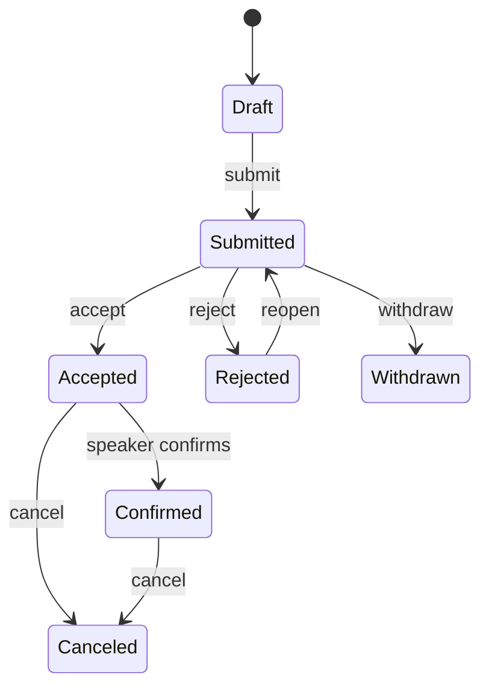

Acceptance extension:

```python
def accept_submission(submission, actor, key):
    with transaction.atomic():
        submission = Submission.all_objects.select_for_update().get(pk=submission.pk)
        assert_transition(submission.state, "accept")
        set_submission_state(submission, ACCEPTED, person=actor, orga=True)

        for speaker_role in submission.speaker_roles.select_related("speaker"):
            instantiate_onboarding_plan(
                event=submission.event,
                submission=submission,
                speaker=speaker_role.speaker,
                source_key=f"accepted:{submission.pk}:{speaker_role.pk}",
            )

        OutboxEvent.ensure(
            key=f"submission.accepted:{submission.pk}:{submission.version}",
            kind="submission.accepted",
            payload={"submission_id": submission.pk},
        )
```

### 17.3 Review-round lifecycle

pretalx `ReviewPhase` remains the authority for permissions and visibility. Add explicit lifecycle commands around activation and closure.

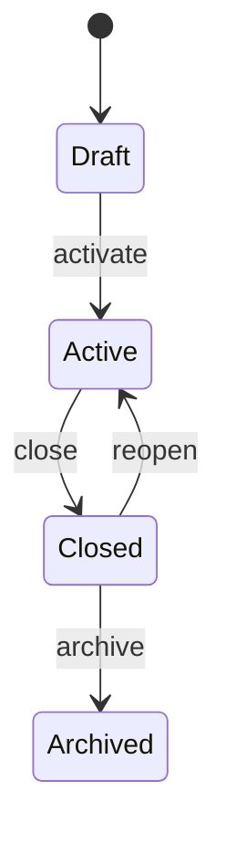

Invariants:

- At most one active phase per event.
- A reviewer may edit only during an active phase where `can_review` is true.
- Reviewer assignment and proposal visibility must both authorize access.
- Criterion definitions are snapshotted when the first review is submitted; later changes create a rubric version.
- AI suggestions never satisfy the human-review uniqueness constraint.

```python
def activate_review_phase(phase, actor):
    with transaction.atomic():
        Event.objects.select_for_update().get(pk=phase.event_id)
        ReviewPhase.objects.filter(event=phase.event, is_active=True).update(is_active=False)
        phase.is_active = True
        phase.lifecycle_state = "active"
        phase.activated_at = now()
        phase.save()
        append_transition(phase, "activate", actor)
```

### 17.4 Human-review lifecycle

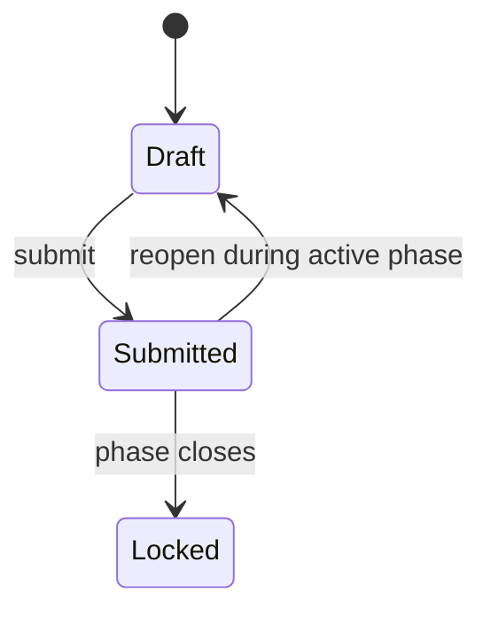

Persist individual criterion selections plus a calculated aggregate. Recalculate through domain code under a row lock; never trust an aggregate sent by the browser.

```python
def submit_review(review, answers, actor):
    with transaction.atomic():
        review = Review.objects.select_for_update().get(pk=review.pk)
        assert actor == review.user
        assert review.event.active_review_phase.can_review
        validate_all_required_categories(answers, review.submission)
        replace_scores(review, answers)
        update_review_score(review)
        review.lifecycle_state = "submitted"
        review.submitted_at = now()
        review.save()
        append_transition(review, "submit", actor)
```

### 17.5 AI-review lifecycle

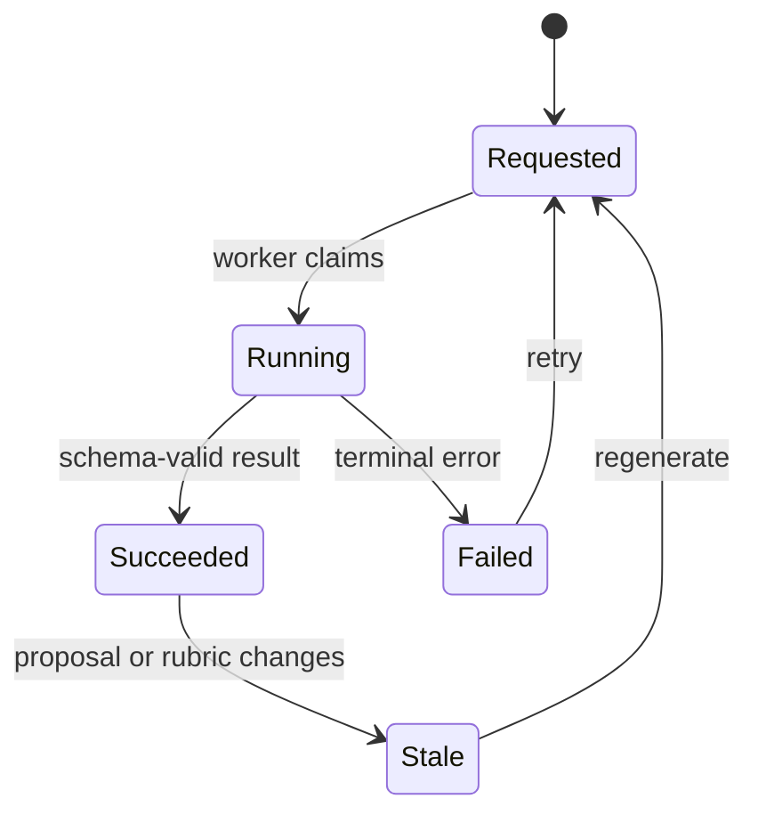

Storage:

```text
AIReviewSuggestion
  event_id, submission_id, review_phase_id
  state, model, prompt_version
  input_fingerprint UNIQUE with model/prompt_version
  rubric_snapshot JSONB
  proposal_snapshot JSONB
  criterion_suggestions JSONB
  rationale, confidence
  provider_request_id, latency_ms, token_usage JSONB, cost_micros
  requested_at, started_at, completed_at, error_code, error_detail
```

```python
def request_ai_review(submission, phase, actor):
    snapshot = build_review_input(submission, phase)
    fingerprint = sha256(canonical_json(snapshot))
    suggestion, created = AIReviewSuggestion.objects.get_or_create(
        submission=submission,
        review_phase=phase,
        input_fingerprint=fingerprint,
        model=AI_MODEL,
        prompt_version=PROMPT_VERSION,
        defaults={"state": "requested", **snapshot},
    )
    if created or suggestion.state in {"failed", "stale"}:
        OutboxEvent.ensure(key=f"ai-review:{suggestion.pk}:{fingerprint}", kind="ai.review.requested")
    return suggestion
```

### 17.6 Speaker-task lifecycle

Store state where workflow intent matters, but calculate satisfaction from authoritative target data. For example, a headshot task is satisfied by a valid stored headshot; the task row does not duplicate the file.

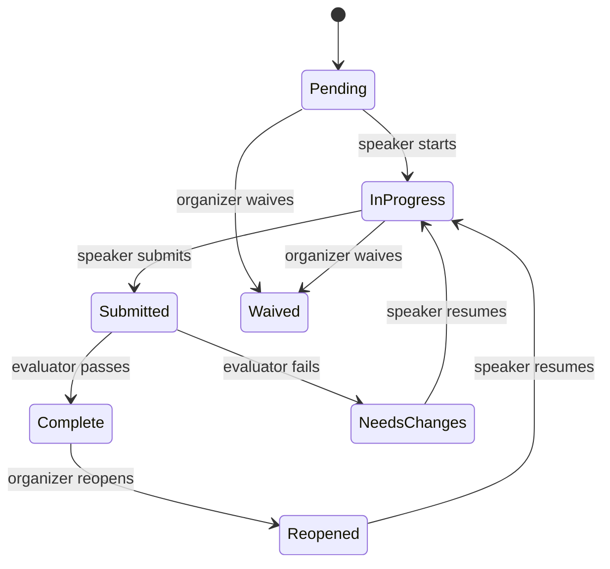

Data model:

```text
TaskTemplate(event_id, name, version, active)
TaskDefinition(template_id, key, title, kind, target_config JSONB,
               due_rule JSONB, completion_rule JSONB, blocking, position)
SpeakerTask(event_id, definition_id, definition_version,
            speaker_id, submission_id NULL, state, due_at,
            started_at, submitted_at, completed_at,
            waived_at, waived_by_id, waiver_reason,
            reopened_at, version)
TaskTransition(task_id, from_state, to_state, command, actor_id, reason, created_at)
```

Instantiation and evaluation:

```python
def instantiate_onboarding_plan(event, submission, speaker, source_key):
    template = event.active_task_template
    for definition in template.definitions.order_by("position"):
        if definition.applies_to(submission, speaker):
            SpeakerTask.objects.get_or_create(
                event=event,
                definition=definition,
                definition_version=template.version,
                speaker=speaker,
                submission=submission if definition.session_specific else None,
                defaults={"state": "pending", "due_at": definition.resolve_due_at(event)},
            )

def evaluate_task(task):
    evaluator = COMPLETION_EVALUATORS[task.definition.kind]
    result = evaluator.evaluate(task.definition.completion_rule, task.speaker, task.submission)
    if result.satisfied and task.state in {"submitted", "needs_changes", "reopened"}:
        transition(task, "complete", actor=SYSTEM, payload={"evidence": result.reference})
    elif not result.satisfied and task.state == "submitted":
        transition(task, "request_changes", actor=SYSTEM, payload={"reason": result.reason})
```

### 17.7 Communication lifecycle

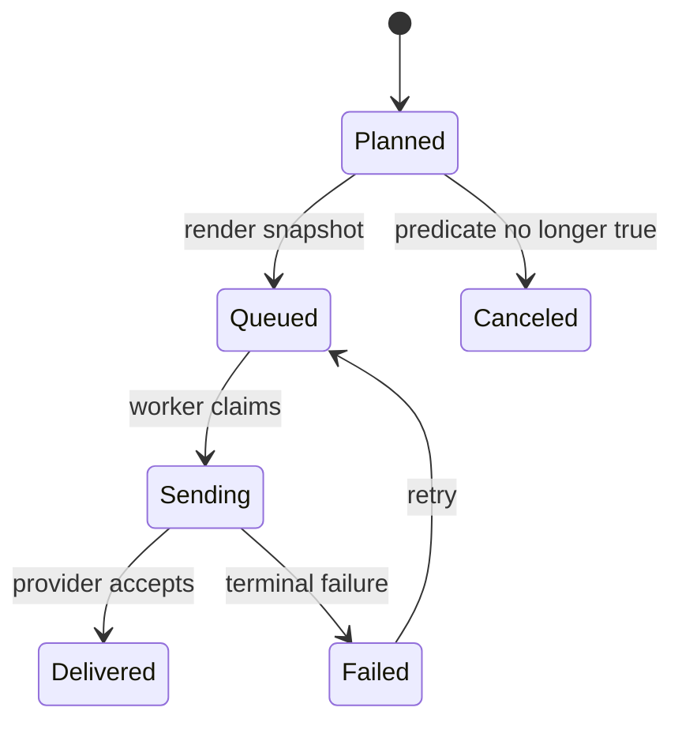

Store immutable rendered content, recipients, attachments/ICS reference, locale, template/version, provider ID, failure, and delivery timestamps. Reminder planning is separate from delivery.

```python
def plan_task_reminders(at):
    for task in outstanding_tasks_due_for_reminder(at):
        dedupe = f"task-reminder:{task.pk}:{task.reminder_stage}:{task.version}"
        CommunicationPlan.objects.get_or_create(
            dedupe_key=dedupe,
            defaults={"task": task, "template": choose_template(task), "state": "planned"},
        )

def queue_communication(plan):
    if not plan.still_applicable():
        return transition(plan, "cancel", SYSTEM)
    rendered = render_template_snapshot(plan.template, plan.context())
    mail = QueuedMail.objects.create(**rendered, state="queued")
    transition(plan, "queue", SYSTEM, payload={"queued_mail_id": mail.pk})
```

### 17.8 Schedule and publication lifecycle

pretalx’s unnamed WIP schedule and named published versions remain canonical.

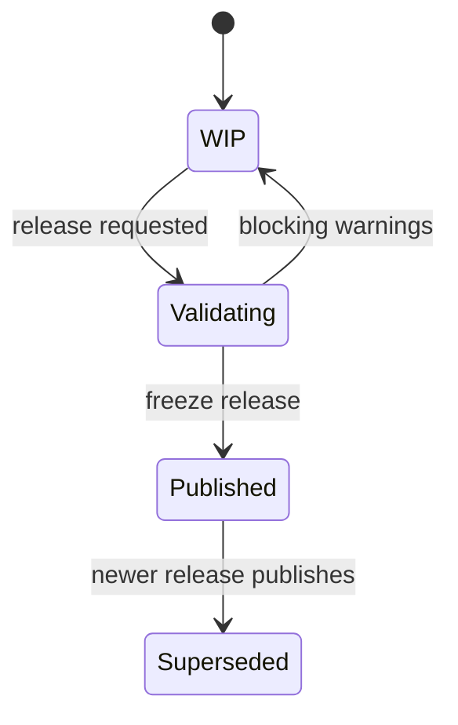

Publication is a consistency boundary:

```python
def publish_schedule(event, version, actor, acknowledged_warning_ids):
    with transaction.atomic():
        event = Event.objects.select_for_update().get(pk=event.pk)
        wip = event.wip_schedule
        warnings = compute_warnings(wip)
        blocking = classify(warnings).blocking
        unacknowledged = classify(warnings).ack_required - set(acknowledged_warning_ids)
        if blocking or unacknowledged:
            raise PublicationBlocked(blocking, unacknowledged)

        released = freeze_schedule(wip, version, notify_speakers=False)
        fingerprint = fingerprint_schedule(released)
        PublicationRecord.objects.create(
            event=event, schedule=released, fingerprint=fingerprint,
            actor=actor, acknowledged_warning_ids=acknowledged_warning_ids,
        )
        OutboxEvent.ensure(
            key=f"schedule.published:{released.pk}:{fingerprint}",
            kind="schedule.published",
            payload={"schedule_id": released.pk, "fingerprint": fingerprint},
        )
    return released
```

Consumers of `schedule.published` create calendar updates, invalidate public/embed caches, mark the previous release superseded, and create an Accelevents sync preview. They do not run inside the publishing transaction.

### 17.9 Accelevents synchronization lifecycle

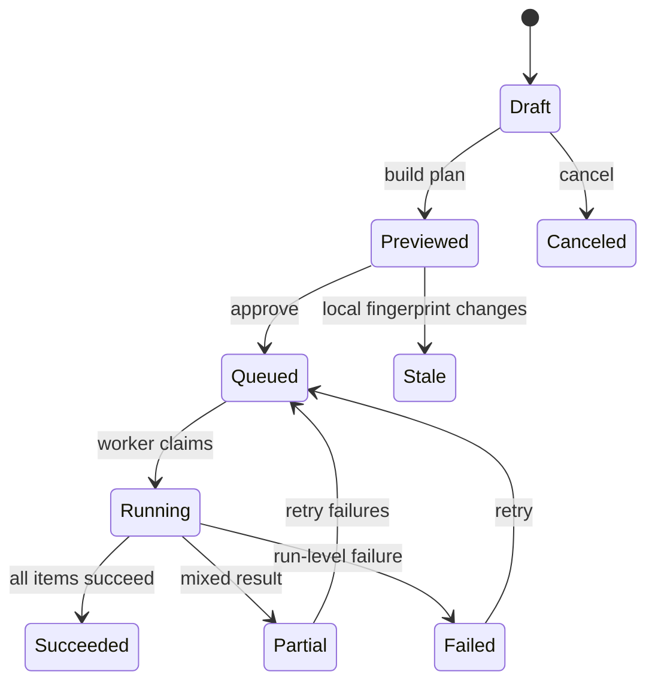

Data model:

```text
IntegrationConnection(event_id, provider, state, encrypted_secret_ref, config JSONB)
IntegrationMapping(connection_id, object_kind, local_key, remote_key, transform)
ExternalIdentity(connection_id, object_kind, local_id, external_id, last_fingerprint)
SyncRun(event_id, connection_id, schedule_id, schedule_fingerprint,
        state, mode, approved_by_id, counts JSONB, started_at, completed_at, error)
SyncItem(sync_run_id, operation, object_kind, local_id, external_id,
         input_fingerprint, payload_snapshot JSONB, state,
         attempts, response_code, provider_request_id, error)
```

Preview and execution:

```python
def preview_accelevents(schedule, connection):
    assert schedule.published
    run = SyncRun.objects.create(
        schedule=schedule,
        schedule_fingerprint=fingerprint_schedule(schedule),
        connection=connection,
        mode="preview",
        state="draft",
    )
    for local in exportable_speakers_and_sessions(schedule):
        payload = map_to_accelevents(local, connection.mappings)
        fingerprint = sha256(canonical_json(payload))
        identity = ExternalIdentity.lookup(connection, local)
        operation = "noop" if identity and identity.last_fingerprint == fingerprint else ("update" if identity else "create")
        SyncItem.objects.create(
            sync_run=run, local=local, external_id=identity.external_id if identity else None,
            operation=operation, input_fingerprint=fingerprint,
            payload_snapshot=redact(payload), state="pending" if operation != "noop" else "unchanged",
        )
    transition(run, "preview", SYSTEM)
    return run

def execute_sync_item(item):
    item = SyncItem.objects.select_for_update().get(pk=item.pk)
    if item.state in {"succeeded", "unchanged"}:
        return
    assert current_local_fingerprint(item) == item.input_fingerprint
    response = adapter.upsert(item.object_kind, item.external_id, reconstruct_secret_payload(item))
    with transaction.atomic():
        ExternalIdentity.upsert_from_response(item, response)
        item.mark_succeeded(response.request_id)
        recompute_run_state(item.sync_run_id)
```

Never send a mutable WIP schedule. If the current local fingerprint differs from the approved preview, mark the run stale and require a new preview.

### 17.10 Resource-page lifecycle

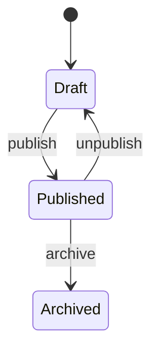

Store sanitized HTML output separately from author input. Allowlisted iframe domains and attributes are event policy, not arbitrary HTML. Every edit increments version; tasks may point to a specific resource version when acknowledgement matters.

## 18. Data representation and storage

### 18.1 Authoritative stores

| Data | Store | Representation |
|---|---|---|
| Events, proposals, people, reviews, tasks, schedules, sync state | PostgreSQL | Normalized relational rows plus constrained JSONB for rules/snapshots |
| Headshots, slides, files | Cloudflare R2 | Object bytes; database metadata and access policy remain authoritative |
| Secrets | Deployment secret store | Reference from DB; never raw values in logs, jobs, or source |
| Search/filter projection | PostgreSQL indexes/materialized query | Rebuildable from authoritative rows |
| Airtable | External projection only | Rebuildable operational mirror, never source of truth |
| Cloudflare cache | Derived public representation | Keyed by event and published schedule/resource version |

### 18.2 Relational vs. JSONB rule

Use columns and foreign keys when the value participates in identity, authorization, joins, uniqueness, lifecycle, or reporting. Use JSONB only for versioned configuration, rule ASTs, redacted provider snapshots, and immutable audit context.

Never place these only in JSONB:

- speaker/proposal membership;
- task current state;
- review assignment;
- schedule placement times and room;
- external identity;
- transition history;
- current sync state.

### 18.3 Versioning and concurrency

Mutable aggregates carry an integer `version`. Commands may require `expected_version`; a mismatch returns conflict rather than silently overwriting collaborator work. Schedule drag/drop uses the placement version. Form drafts autosave with compare-and-swap semantics.

```python
updated = SchedulePlacement.objects.filter(pk=id, version=expected).update(
    room=room, start=start, end=end, version=F("version") + 1
)
if updated != 1:
    raise ConcurrentModification()
```

### 18.4 Deletion

- Business records use archive/anonymize transitions rather than hard deletion after submission.
- Personal data deletion follows pretalx’s personal-data flags and legal policy.
- External identities survive ordinary archival so a later sync can issue explicit removal/cancellation.
- Files are deleted asynchronously only after no authoritative record references them.

## 19. Event and data flow

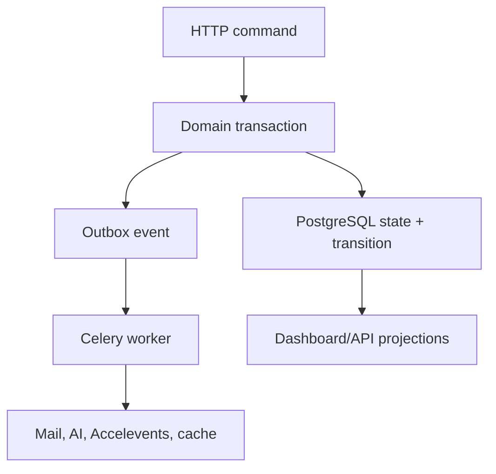

Outbox dispatch:

```python
def dispatch_outbox(batch_size=100):
    events = OutboxEvent.claim_ready(batch_size, skip_locked=True)
    for event in events:
        try:
            for handler in HANDLERS[event.kind]:
                ConsumerReceipt.run_once(event.id, handler.name, lambda: handler(event.payload))
            event.mark_dispatched()
        except RetryableError as error:
            event.reschedule(backoff(event.attempts), error)
        except TerminalError as error:
            event.mark_failed(error)
```

Primary flows:

1. **Proposal accepted:** submission transition → onboarding plan → acceptance mail plan → dashboard projection invalidation.
2. **Task evidence changes:** file/question/profile write → task reevaluation → completion transition → dashboard update.
3. **Review input changes:** proposal/rubric fingerprint changes → existing AI suggestion marked stale → optional regeneration.
4. **Schedule published:** immutable release → cache invalidation → ICS deliveries → Accelevents preview.
5. **Accelevents approval:** preview lock → per-item jobs → external identities → run aggregate status.

## 20. Implementation plan by dependency

### Slice 0: rules and foundation

- Obtain derivative-work ruling.
- Fork at a pinned pretalx commit and record upstream remote.
- Verify license/attribution surface.
- Boot local event and baseline test suite.
- Deploy unchanged foundation to the Droplet.

### Slice 1: acceptance creates work

- TaskTemplate, TaskDefinition, SpeakerTask, transitions.
- Acceptance hook through submission domain service/on-commit event.
- Speaker checklist and organizer outstanding table.
- Golden-path tests for idempotent task instantiation.

### Slice 2: task evidence and reminders

- Completion evaluators for profile, question, file, acknowledgement.
- Dashboard counts and drilldowns.
- Reminder planning and queued-mail snapshot.
- Resource pages with sanitized embeds.

### Slice 3: publish boundary

- Warning classification and acknowledgement.
- Published schedule fingerprint.
- ICS artifact/delivery versioning.
- Mobile gallery and itinerary embeds.

### Slice 4: Accelevents

- Connection/mapping/external identity.
- Preview/run/item models and FSM.
- Fixture-backed contract tests.
- Real sandbox adapter if credentials exist.

### Slice 5: review differentiation

- Conditional rule AST and category routing.
- AI suggestion model, job, schema validation, stale detection.
- Multiple-round demo fixture using pretalx review phases.

### Slice 6: freeze and proof

- Acceptance matrix automated tests.
- Seeded conflict, late task, failed sync, and successful path.
- Performance budget and query inspection.
- Deployment rollback rehearsal.
- Walkthrough and submission documentation.

## 21. Open questions

1. Should staging and production share one Droplet for the competition, or is a second small staging Droplet available?
2. Is DigitalOcean Managed PostgreSQL within budget, or must a temporary PostgreSQL accessory run on the Droplet with explicit backups and accepted single-host risk?
3. Does the competition evaluator require application compute on Cloudflare or merely reward meaningful Cloudflare infrastructure?
4. Can Cloudflare Containers reliably support the required worker process during the judging window?
5. Will Accelevents provide sandbox credentials before the deadline?
6. Which broker/backend is already supported by the pinned pretalx Celery configuration? If Rails activates, use Solid Queue unless an existing Redis standard exists.
7. Are disclosed forks or derivative works of pretalx permitted? This must be resolved before feature implementation.

### 21.1 Defaults when answers do not arrive

- Use one production Droplet and ephemeral CI previews; do not let staging infrastructure delay the judge endpoint.
- Use Managed PostgreSQL when available. If budget blocks it, run PostgreSQL as a backed-up accessory and record the accepted single-host risk.
- Treat Cloudflare DNS, proxy, WAF/rate limiting, Turnstile, cache, and R2 as the required Cloudflare contribution; Containers remain bonus-only.
- Use the broker already declared by the pinned pretalx deployment configuration.
- Ship a contract-tested Accelevents adapter and visible credential-blocked state if sandbox access is unavailable.
- Deliver versioned ICS unless the brief owner explicitly requires OAuth insertion into Google or Microsoft calendars.

## 22. DeepWiki and source-evidence policy

DeepWiki is the architectural navigation source for extension work, not runtime truth. Its pretalx index identifies revision `6e6d5f` indexed on 2026-01-24, while implementation will pin a newer upstream revision. Every material extension therefore follows this evidence order:

1. The canonical competition brief defines required behavior.
2. The PRD and this RFC define product and architecture decisions.
3. DeepWiki identifies likely subsystems, extension hooks, data flows, and source files.
4. The exact pinned pretalx source and tests verify current behavior, signatures, license, and invariants.
5. A local decision-evidence record documents the gap, alternatives, chosen seam, and acceptance test.

Prefer a plugin or documented signal when it can preserve the invariant. Patch core only when no supported seam can enforce an atomic domain rule or produce the required journey. Every core patch must be small, identified as a modification, covered by regression tests, and maintained as an explicit upstream delta.

## 23. References

- [Cloudflare Containers: getting started](https://developers.cloudflare.com/containers/get-started/)
- [DigitalOcean Droplets](https://docs.digitalocean.com/products/droplets/)
- [DigitalOcean Container Registry](https://docs.digitalocean.com/products/container-registry/)
- [Kamal](https://kamal-deploy.org/)
- [Kamal rollback](https://kamal-deploy.org/docs/commands/rollback/)
- [Cloudflare Workers framework guides](https://developers.cloudflare.com/workers/framework-guides/)
- [Rails Active Job](https://guides.rubyonrails.org/active_job_basics.html)
- [Rails Active Storage](https://guides.rubyonrails.org/active_storage_overview.html)
- [Rails Action Mailer](https://guides.rubyonrails.org/action_mailer_basics.html)
- [Violet Rails](https://github.com/restarone/violet_rails)
- [pretalx](https://github.com/pretalx/pretalx)
- [pretalx current license](https://github.com/pretalx/pretalx/blob/main/LICENSE)
- [pretalx submission domain](https://github.com/pretalx/pretalx/blob/main/src/pretalx/submission/domain/submission.py)
- [pretalx review models](https://github.com/pretalx/pretalx/blob/main/src/pretalx/submission/models/review.py)
- [pretalx schedule release](https://github.com/pretalx/pretalx/blob/main/src/pretalx/schedule/domain/release.py)
- [frab](https://github.com/frab/frab)
- [pretalx architecture on DeepWiki](https://deepwiki.com/pretalx/pretalx)
- [pretalx schedule editor on DeepWiki](https://deepwiki.com/pretalx/pretalx/5.2-schedule-editor-interface)
- [eventyay-talk architecture on DeepWiki](https://deepwiki.com/fossasia/eventyay-talk/2-core-architecture)

## 24. Changelog

- 2026-08-08: Initial RFC proposing portable Rails container, reliable primary compute, and additive Cloudflare integration.
- 2026-08-08: Selected a DigitalOcean Droplet with Kamal as primary compute and added Droplet provisioning, CI/CD, security, recovery, and rollback requirements.
- 2026-08-08: Reconciled the live acceptance sheet, selected pretalx-first with a mandatory derivative-work rules gate, retained Rails as clean-room fallback, and specified state machines, storage, mutation, outbox, data-flow, and implementation slices.
- 2026-08-08: Finalized pretalx/DigitalOcean/Cloudflare architecture, Rails contingency, unanswered-question defaults, and DeepWiki-to-pinned-source evidence policy.
